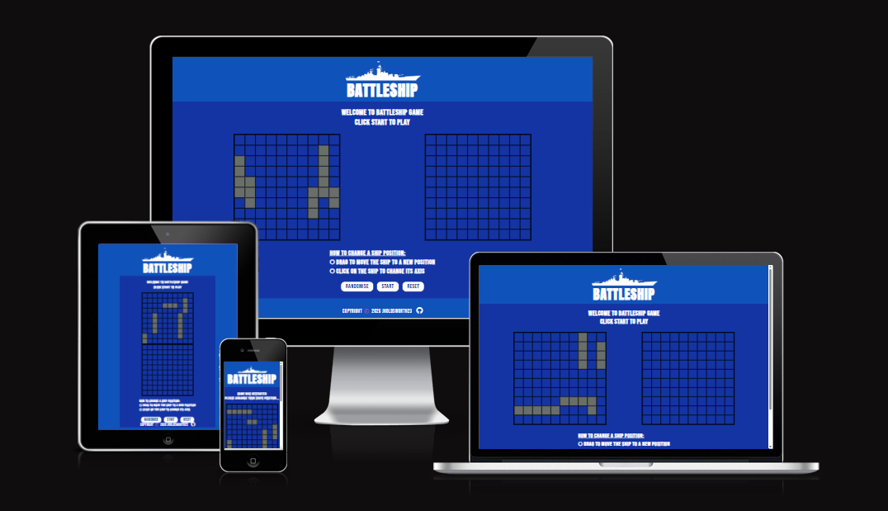

# ⚓ Battleship

## Introduction
**Battleship** is an iconic strategy game for two players (or player vs AI) where the objective is to sink all of your opponent's ships before they sink yours. 

### Gameplay Overview
1. Preparation Phase
    - Each player arranges their ships on their grid either manually or randomly.
    - Ships cannot overlap and can be placed horizontally or vertically.
2. Battle Phase
    - Players take turns guessing coordinates to target the opponent's ships.
    - Opponent responds with "hit" if a ship is attacked, or "miss" otherwise.
    - When all coordinates of a ship are hit, the ship is considered sunk.

3. Endgame: Winning the Game
    - The game ends when one player has sunk all the opponent's ships.
    - That player is declared victorious.

## 📑 Table of Contents
- [The Vision](#-the-vision)
- [Features](#-features)
- [UI/UX](#-uiux)
- [Getting Started](#-getting-started)
- [Usage](#-usage)
- [Tech Stack](#-tech-stack)
- [Architecture](#-architecture)
- [Testing](#-testing)
- [Future Improvements](#-future-improvements)

## 🎯 The Vision

## 🎨 UI/UX 

## ✨ Features

## 🚀 Getting Started
**Prerequisites**

### Installation & Setup

## ⚡Usage

## 🛠️ Tech Stack
**HTML5** – Utilized semantic markup to ensure a highly accessible for the 10×10 coordinate grids and interactive UI components.
**CSS3** – Implemented modern layout techniques including Flexbox and CSS Grid, utilizing Custom Properties (Variables) for a maintainable and responsive design across all device sizes.
**JavaScript (ES6+)** – Engineered the core game engine using Modular JS. Leveraged advanced concepts like ES6 Classes and Array methods to manage game logic, AI behaviour, and DOM manipulation.
**Webpack** – Configured a custom build pipeline to bundle modules, manage assets, and utilize Loaders/Plugins for an optimized production-ready distribution.
**Jest** – Integrated a robust automated testing suite. Followed a TDD (Test-Driven Development) workflow to validate the integrity of the Ship and Gameboard logic before UI integration.
**ESLint** – Enforced high-quality code standards and consistent style guides, ensuring the codebase remains clean, readable, and free of common syntax anti-patterns.

## 🧠 Architecture

## 🧩 Development Principles

## 🧪 Testing

## 🔮 Future Improvements
