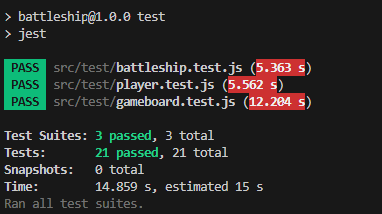

# ⚓ Battleship

## 🌐 Live Demo
Play the game here:
👉 https://jpholdsworth.github.io/battleship/


## Introduction
**Battleship** is an iconic strategy game for two players (or player vs AI) where the objective is to sink all of your opponent's ships before they sink yours. 

### Gameplay Overview
1. Preparation Phase
    - Each player arranges their ships on their grid either manually or randomly.
    - Ships cannot overlap and can be placed horizontally or vertically.
2. Battle Phase
    - Players take turns guessing coordinates to target the opponent's ships.
    - Opponent responds with "hit" if a ship is attacked, or "miss" otherwise.
    - When all coordinates of a ship are hit, the ship is considered sunk.

3. Endgame: Winning the Game
    - The game ends when one player has sunk all the opponent's ships.
    - That player is declared victorious.


## 📑 Table of Contents
- [The Vision](#-the-vision)
- [Features](#-features)
- [UI/UX](#-uiux)
- [Getting Started](#-getting-started)
- [Usage](#-usage)
- [Tech Stack](#-tech-stack)
- [Architecture](#-architecture)
- [Testing](#-testing)
- [Future Improvements](#-future-improvements)


## 🎯 The Vision
This project is a browser-based implementation of the classic strategy game Battleship. Its goals are to:

- **Engage Players** - Offer an interactive way to play against an intelligent AI opponent.
- **Showcase Architecture** - Demonstrate a modular JavaScript design that cleanly separates game logic, AI behaviour, and UI rendering.
- **Dynamic Mechanics** - Implement complex state management for turn-taking, ship destruction, and real-time grid updates.
- **Professional Tooling** - Serve as a technical case study for Test-Driven Development (TDD) with Jest and optimized bundling with Webpack.

This project balances challenging AI gameplay with clean, maintainable code, showing how classic mechanics can be rebuilt with modern programming practices.

## ✨ Features
- **Hunt & Target AI** - The computer alternates between random attacks and focused targeting once a ship is hit.
- **Drag-and-Drop Ship Placement** - Manually position ships or use the Randomise button for quick setup.
- **Ship Rotation** - Rotate ships horizontally or vertically before deployment.
- **Visual Feedback** - Clear indicators for hits (💥) and misses (⚪) ensure players always know the outcome of each turn.
- **Responsive Design** - Works seamlessly across desktop, tablet, and mobile devices.
- **Reset & Replay** - Restart the game at any time without refreshing the browser.
- **Tested Core Logic** - Ships, gameboards, and player mechanics are fully verified with Jest for reliability.

## 🎨 UI/UX 
The interface recreates the classic Battleship experience with a modern, browser-friendly design focused on clarity, visual feedback, and strategic gameplay.

### Design Principles
- **Clarity First** — visually distinct player and enemy boards ensure the game state is readable at a glance
- **Immediate Feedback** — visual responses communicate the outcome of every action
- **Minimal Distractions** — a clean layout keeps focus on gameplay, with UI elements that guide rather than overwhelm

### Grid Interaction
- Classic 10×10 coordinate grids replicate traditional gameplay
- Interactive hover and click states improve usability
- Visual indicators:
  - 💥 **Hit** — explosion marker displayed on a grey background
  - ⚪ **Miss** — water impact indicator displayed on a blue background

### Ship Placement
- Drag-and-drop fleet preparation
- Ship rotation (horizontal / vertical)
- Randomise option for quick setup
- Automatic validation prevents invalid placement

### Gameplay Experience
- Turn-based flow clearly communicated at each stage
- Instant AI responses maintain pacing and momentum
- Ships visually indicate when fully sunk
 
### Responsive Design
- Built using Flexbox and CSS Grid for consistent layout behaviour
- Interface adapts across desktop, tablet, and mobile while preserving grid alignment and usability

The UI prioritises fast interaction, clear communication of game state, and an accessible gameplay loop, resulting in a familiar yet modern Battleship experience that feels responsive, strategic, and easy to learn.

## 🚀 Getting Started
**Prerequisites**
- Node.js (14v+)
- npx (included with Node.js)

### Installation & Setup
> [!TIP]
> No installation is required when using the live demo — simply open the game in your browser.

1. Clone the repository
```bash
git clone https://github.com/jpholdsworth/battleship.git
cd battleship
```

2. Install dependencies
```bash
npm install
```

3. Build the project
```bash
npx webpack
```
The bundled output is written to `/dist`. Open `dist/index.html` in your browser to play.

4. Deploy to Github Pages *(optional)*
```bash
npm run deploy
```

## ⚡ Usage

### 🎮 How to Play
1. 🚢 **Prepare Your Fleet**
   - **Manual Setup** - Drag and drop your ships onto the 10×10 grid.
   - **Randomise** - Click the **Randomise** button to automatically position ships.
   - **Rotate** - Click a ship to toggle between *horizontal* and *vertical* orientation.
   - *Note: Ships cannot overlap or be placed outside the grid.*

2. 💥 **Begin the Battle**
   - Click a cell on the enemy (hidden) grid to launch an attack.
   - **Hit** - An explosion with a grey background indicates a successful strike.
   - **Miss** - A white dot indicates open water.

3. 🤖 **Compete Against the Computer**
   - After your move, the computer immediately takes its turn.
   - The computer follows a *Hunt & Target strategy*:
     - **Hunt:** Fires randomly to locate ships.
     - **Target:** Once a ship is hit, attacks adjacent cells until the ship is sunk.

4. 🎯 **Sink the Enemy Fleet**
   - Players alternate turns throughout the game.
   - A ship is officially *sunk* when all of its coordinates have been hit.

5. 🏆 **Win Condition**
   - The first player to destroy all **five ships** wins the game.

---

### 🖱️ Controls
- **Mouse Click** - Select a coordinate to attack.
- **Restart** - Click the `Restart` button to begin a new game.

## 🛠️ Tech Stack
- **HTML5** – Utilized semantic markup to ensure a highly accessible for the 10×10 coordinate grids and interactive UI components.
- **CSS3** – Implemented modern layout techniques including Flexbox and CSS Grid, utilizing Custom Properties (Variables) for a maintainable and responsive design across all device sizes.
- **JavaScript (ES6+)** – Engineered the core game engine using Modular JS. Leveraged advanced concepts like ES6 Classes and Array methods to manage game logic, AI behaviour, and DOM manipulation.
- **Webpack** – Configured a custom build pipeline to bundle modules, manage assets, and utilize Loaders for an optimized production-ready distribution.
- **Jest** – Integrated a robust automated testing suite. Followed a TDD (Test-Driven Development) workflow to validate the integrity of the Battleship and Gameboard logic before UI integration.
- **ESLint** – Enforced high-quality code standards and consistent style guides, ensuring the codebase remains clean, readable, and free of common syntax anti-patterns.

## 🧠 Architecture
The Battleship application follows a modular JavaScript architecture to separate game logic, AI behaviour and DOM manipulations for presentation, maintainability and testability. The codebase is organised into different directories, each with a distinct purpose.

```
src/
├── /dom    # DOM manipulation and UI interaction
│   ├── gamemanager.js      # Orchestrates game flow, turn logic and win detection
│   ├── userinterface.js    # Renders grid, handles drag-and-drop and DOM updates    
│   └── webpage.js          # Generate a static footer section
├── /fonts
├── /image
├── /modules    # Core game logic with no DOM dependencies
│   ├── ai.js           # Computer decision-making using Hunt & Target algorithm
│   ├── battleship.js   # Ship entity - tracks hits, sunk status and orientation
│   ├── gameboard.js    # 10x10 grid - ship placement, attack registration and validation
│   └── player.js       # Player entity - manages ship and pass on attacks to Gameboard
├── /test   # Jest unit tests for core game logic
│   ├── battleship.test.js
│   ├── gameboard.test.js
│   └── player.test.js
└── index.js    # Entry point - initialises GameManager and starts the game
```

### 📦 Core Modules
- **`battleship.js`** - Defines ship objects with `length`, `hitCount`, `sunk` state, and `axis`. Registers hits and determines when a ship is fully sunk.  
- **`gameboard.js`** - Manages the 10×10 grid. Handles ship placement with bounds and overlap validation, registers attacks, and tracks previously targeted coordinates.  
- **`player.js`** - Represents a human player. Manages the fleet and delegates attacks to the `Gameboard`, keeping player state separate from board logic.  
- **`ai.js`** - Controls the computer opponent using a Hunt & Target strategy, switching between random fire and focused targeting based on hit results.  
- **`gamemanager.js`** - Orchestrates game flow: turn order, player and AI moves, start/reset actions, and win detection. Simulates AI thinking with a randomised delay.  
- **`userinterface.js`** - Handles all DOM interaction: renders grids, updates cell states (hit, miss, ship), manages drag-and-drop and rotation, controls buttons, and displays messages.

### 🗝️ Key Design Decisions
- **Class-based entities** — `Ship`, `Gameboard`, and `Player` are ES6 classes. Each encapsulates its own state and exposes a focused public interface, making them easy to instantiate, compose, and test in isolation.
- **Logic isolated from the DOM** — core classes carry zero DOM dependencies. They operate purely on data, so Jest can exercise them without a browser environment.
- **Hunt & Target AI** - The AI queues adjacent coordinates after a hit and clears the queue once the ship is sunk, switching between exploration and focused targeting for human-like behaviour.
- **Modular and maintainable** - Each module has a single responsibility, making the code easier to understand, test, and extend.

### 🤖 AI: Hunt & Target Algorithm
The AI module controls the computer's decision making. It implements a *Hunt & Target strategy*, allowing the AI to anticipate future coordinates once a player's ship has been hit and efficiently locate the remaining parts of the ship.
1. **Hunting Mode**

   At the start of the game, the computer fires at a random cell using a `do... while` loop that keeps generating coordinates until it finds a coordinate that hasn't already been attacked.
    - A random coordinate is generated.
    - The algorithm ensures the coordinate has not been previously attacked.
    - This enables efficient board exploration until a player's ship is discovered.
```js
do {
    x = Math.floor(Math.random() * 10);
    y = Math.floor(Math.random() * 10);
} while (this.player.gameboard.board[x][y] === 'hit' || this.player.gameboard.board[x][y] === 'miss');
```

The computer remains in Hunting Mode until a successful hit occurs, triggering a transition to Target Mode.

2. **Target Mode**

   Once a hit is registered, the computer switches to Target Mode, concentrating attacks on the surrounding area.
    - Previous successful hits are stored in the `this.nextAttacks` array property.
    - The computer calculates and attempts attacks on adjacent coordinates (up, down, left, right) of the last successful hit.
```js
const coordinates = [
    [lastHitX - 1, lastHitY], [lastHitX + 1, lastHitY],
    [lastHitX, lastHitY - 1], [lastHitX, lastHitY + 1]
];
```

3. **Attack Anticipation and Tracking**

   When the attack is successful, the `attackCoordinate(x, y)` method processes hit result for the computer and the coordinate is pushed into the  `nextAttacks` stack so the computer can continue targeting the same ship on subsequent turns.
    - If the attack results in a hit, the coordinate is stored for future targeting.
    - Else, the coordinate will be ignored and the computer will use the next available coordinate in the `nextAttacks` stack.
```js
const hitSuccessful = this.player.gameboard.attackCoordinate(x, y);
if (hitSuccessful === 'hit') {
    this.nextAttacks.push([x, y]);
}
```
Once the ship is sunk, `nextAttacks` is cleared and the computer switches back to Hunting Mode until the next hit. This follows a stack (FILO - First   In, Last Out) principle.

4. **Valid Attack Check**

   Before committing to any coordinate, the algorithm must validate it to ensure:
    - It falls within the 10x10 grid and 
    - It hasn't already been attacked previously.
```js
validAttack(x, y) {
    return x >= 0 && x < 10 &&
           y >= 0 && y < 10 &&
           this.player.gameboard.board[x][y] !== 'hit' &&
           this.player.gameboard.board[x][y] !== 'miss';
}
```

This simple yet powerful algorithm balances exploration and attack mode, enabling the computer to efficiently discover ships while aggressively completing confirmed targets, resulting in a more strategic and human-like opponent.

## 🧩 Development Principles
- **Modular Design** - Each JavaScript module has a single responsibility, making the code easier to understand, test, and extend.
- **Separation of Concerns** - AI handles decision-making, Gameboard manages state and gameplay, and the UI renders the game, avoiding tight coupling between logic and presentation.
- **Test-Driven Development (TDD)** - Core game logic was implemented and verified with automated Jest tests before UI integration, ensuring correctness at every stage.
- **Reusable Validation Logic** - Shared coordinate validation across Gameboard and Player reduces duplication and keeps placement and attack-checking consistent throughout the codebase.
- **Performance-Oriented** - The AI’s validAttack check runs in O(1) time by reading directly from board state instead of searching previous moves, enabling smooth gameplay even with multiple state changes per turn.

## 🧪 Testing
The project follows a **Test-Driven Development (TDD)** workflow using **Jest** to validate the core game logic before integrating the UI layer.

Unit tests focus on validating game mechanics independently from DOM rendering, allowing logic to remain predictable, maintainable and easy to refactor. Tests are located in `src/test/`.

### 📊 Test Results


### ▶️ Running Tests
Run the full test suite:
```bash
npm test
```

### ✅ Tested Modules
`battleship.js`:
- Verifies ship objects are initialised with correct properties.
- Increments the ship’s `hitCount` when a successful hit occurs.
- Determines when a ship is sunk by comparing `hitCount` against ship `length`.

`gameboard.js`:
- Validates ship placement on both valid and invalid coordinates.
- Prevents overlapping ship placement.
- Records attacks on individual cells.
- Tracks previously targeted coordinates to prevent duplicate attacks.

`player.js`:
- Ensures ships are placed on the intended coordinates.
- Validates player interactions with the gameboard.

## 🔮 Future Improvements
The following enhancements are planned to enrich gameplay, improve user experience, and increase technical capabilities of the Battleship application:
- [ ] **Smarter AI Behaviour**:
    - Implement probability-based targeting to create a more challenging opponent.
- [ ] **Difficulty Levels**:
    - Easy - AI performs fully randomised attacks.
    - Medium - Hunt & Target strategy *(current implementation)*.
    - Hard - Probability-driven targeting system for advanced decision-making.
- [ ] **Improved Game Feedback**:
    - Optional audio feedback for hits, misses, and ship destruction.
    - Enhanced visual cues for turn transitions.
    - Animations when ships are fully sunk.
- [ ] **Multiplayer Mode**:
    - Local two-player mode on a single device.
    - Potential online multiplayer implementation.

## ⚡ Final Note
Challenge the AI, sink your opponent’s fleet, and experience Battleship reimagined for the modern web—fun, strategic, and fully responsive!

## 📜 License
This project is licensed under the [MIT License](https://mit-license.org/).

---

<div align="center">
**Made with ❤️ and ☕ by Jacob Holdsworth.**
    
[👆 Back to Top](#-battleship)
</div>
